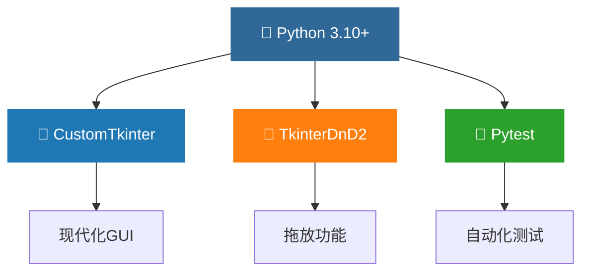
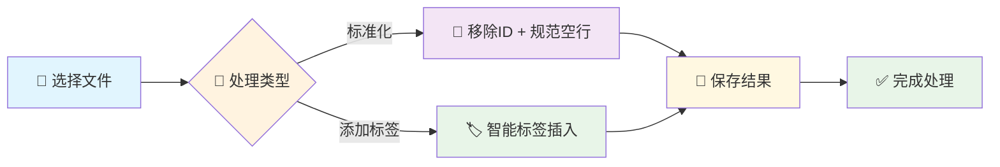
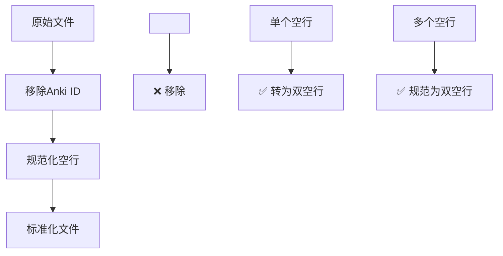
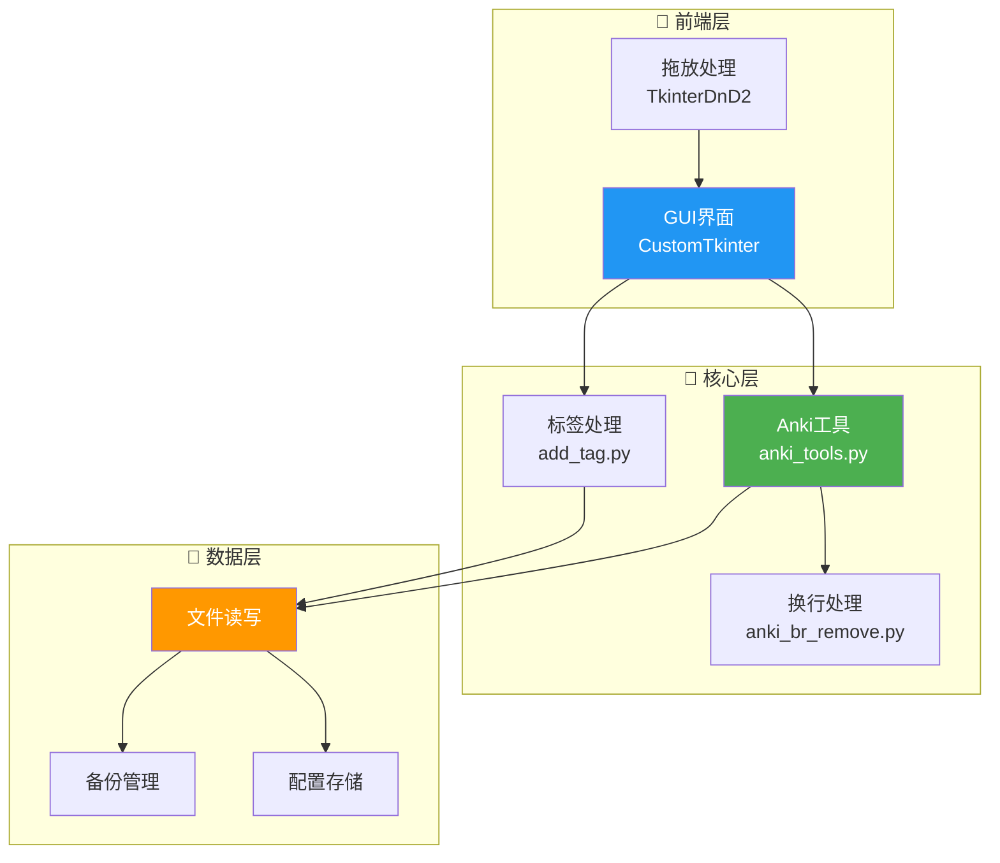
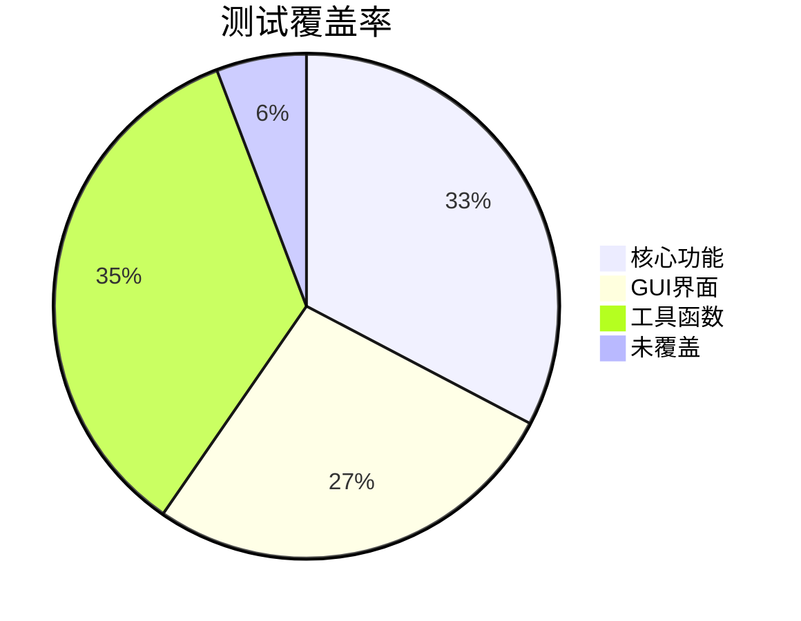

<div align="center">

# 🎴 Anki 笔记处理工具


📝 **一个强大的工具，用于处理和优化 Anki 笔记文件。让你的笔记更加整洁有序！**

[快速开始](#-快速开始) • [功能特性](#-功能特性) • [安装方法](#-安装方法) • [使用指南](#-使用指南) • [API文档](#-api文档) • [贡献指南](#-贡献指南)

</div>

## 📖 目录

- [✨ 功能特性](#-功能特性)
- [🔧 技术栈](#-技术栈)
- [📥 安装方法](#-安装方法)
- [🚀 快速开始](#-快速开始)
- [📚 使用指南](#-使用指南)
- [🏗️ 项目架构](#-项目架构)
- [📁 项目结构](#-项目结构)
- [🧪 测试](#-测试)
- [📊 性能指标](#-性能指标)
- [🤝 贡献指南](#-贡献指南)
- [📄 许可证](#-许可证)
- [💖 致谢](#-致谢)

## ✨ 功能特性

- 🧹 **移除 Anki ID 标记** - 清理笔记中不需要的 ID 标记，保持文档整洁
- 📏 **规范化空行** - 自动调整文档空行，保持格式一致性
- 🏷️ **智能添加标签** - 在段落后自动添加标签，便于分类管理
- 🖱️ **拖放操作** - 直观的拖拽界面，简单易用
- ⚡ **批量处理** - 支持批量处理多个文件，提高效率
- 💾 **备份保护** - 自动备份原文件，确保数据安全
- 🎯 **精准处理** - 精确识别和处理Anki格式标记

## 🔧 技术栈



## 📥 安装方法

### 🎯 方法一：下载预编译版本 (推荐)

> 📌 **适用于普通用户，无需配置Python环境**

1. 📥 前往 [Releases](https://github.com/yourusername/tool_for_anki/releases) 页面
2. ⬇️ 下载最新的 `Anki笔记处理工具.zip` 文件
3. 📂 解压到任意目录
4. ▶️ 双击运行 `Anki笔记处理工具.exe`

### 🔧 方法二：从源码安装

> 📌 **适用于开发者或高级用户**

#### 环境要求


#### 安装步骤

```bash
# 📥 克隆仓库
git clone https://github.com/yourusername/tool_for_anki.git
cd tool_for_anki

# 🔧 安装依赖
pip install -r requirements.txt

# ▶️ 运行应用
python main.py
```

#### 开发者安装

```bash
# 📥 克隆并安装为可编辑包
git clone https://github.com/yourusername/tool_for_anki.git
cd tool_for_anki

# 🔧 创建虚拟环境 (推荐)
python -m venv venv
.\venv\Scripts\activate  # Windows
# source venv/bin/activate  # Linux/macOS

# 📦 安装开发依赖
pip install -e .
pip install -r requirements-dev.txt
```

## 🚀 快速开始



### 🖥️ 启动应用

```bash
python main.py
```

## 📚 使用指南

### 🎯 核心功能详解

#### 1️⃣ 标准化笔记处理



#### 2️⃣ 智能标签添加


### 📱 界面操作

1. 🔄 **标准化笔记**：
   - 点击切换到 "标准化" 选项卡
   - 将 `.md` 文件拖放到指定区域
   - 点击 "标准化文件" 按钮开始处理

2. 🏷️ **添加标签**：
   - 点击切换到 "添加标签" 选项卡  
   - 在输入框中输入标签名（无需 # 符号）
   - 将文件拖放到指定区域
   - 点击 "添加标签" 按钮开始处理

### 💡 使用技巧

- 💾 **自动备份**：每次处理前会自动创建备份文件
- 📁 **批量处理**：可同时拖入多个文件进行批量操作
- ⚡ **快捷键**：支持 `Ctrl+O` 打开文件，`Ctrl+S` 保存结果
- 🔍 **预览功能**：处理前可预览文件内容和变更

## 🏗️ 项目架构



## 🔍 功能说明

### 🧹 移除 Anki ID

```markdown
<!-- 处理前 -->
这是一段笔记内容。
<!--ID: 1234567890-->

<!-- 处理后 -->
这是一段笔记内容。
```

### 📏 规范化空行

```markdown
<!-- 处理前 -->
段落一

段落二


段落三

<!-- 处理后 -->
段落一


段落二


段落三
```

### 🏷️ 添加标签

```markdown
<!-- 处理前 -->
这是第一段内容。


这是第二段内容。

<!-- 处理后（添加标签"学习"） -->
这是第一段内容。


这是第二段内容。
#学习
```

## 📁 项目结构

```
📦 tool_for_anki/
├── 📄 main.py                    # 🚀 程序入口
├── 📄 README.md                  # 📖 项目说明
├── 📄 requirements.txt           # 📋 依赖列表
├── 📁 tool_for_anki/            # 🏠 主包目录
│   ├── 📄 __init__.py           # 📦 包初始化
│   ├── 📁 core/                 # 🧠 核心功能模块
│   │   ├── 📄 __init__.py       # 📦 模块初始化
│   │   ├── 📄 anki_tools.py     # 🔧 Anki笔记处理核心
│   │   ├── 📄 add_tag.py        # 🏷️ 标签添加功能
│   │   └── 📄 anki_br_remove.py # 📏 换行规范化
│   └── 📁 gui/                  # 🎨 图形界面模块
│       ├── 📄 __init__.py       # 📦 GUI初始化
│       └── 📄 app.py            # 🖥️ GUI应用主体
├── 📁 tests/                    # 🧪 测试文件目录
│   ├── 📄 __init__.py           # 📦 测试包初始化
│   ├── 📄 test_anki_tools.py    # 🔍 核心功能测试
│   └── 📄 Ted-ed.md             # 📝 测试用例文件
└── 📁 docs/                     # 📚 文档目录
    └── 📄 prompt.md             # 💡 提示文档
```

## 🧪 测试

### ⚡ 运行测试

```bash
# 🧪 运行所有测试
pytest

# 🔍 运行特定测试文件
pytest tests/test_anki_tools.py

# 📊 生成覆盖率报告
pytest --cov=tool_for_anki

# 🔬 详细输出模式
pytest -v
```

### 📋 测试覆盖



## 📊 性能指标

| 🏷️ 指标 | 📈 数值 | 📝 说明 |
|---------|--------|---------|
| ⚡ 处理速度 | ~1000行/秒 | 中等大小文件处理速度 |
| 💾 内存占用 | <50MB | 运行时内存使用 |
| 📁 文件支持 | .md, .txt | 支持的文件格式 |
| 🔄 批处理 | 无限制 | 可同时处理文件数 |

## 🐛 故障排除

<details>
<summary>🔧 常见问题解决方案</summary>

### ❌ Python版本问题
```bash
# 检查Python版本
python --version

# 如果版本低于3.10，请升级Python
```

### ❌ 依赖安装失败
```bash
# 更新pip
python -m pip install --upgrade pip

# 重新安装依赖
pip install -r requirements.txt --force-reinstall
```

### ❌ GUI显示异常
```bash
# 检查显示缩放设置
# Windows: 设置 > 系统 > 显示 > 缩放 (推荐100%)
```

</details>

## 🤝 贡献指南

我们欢迎各种形式的贡献！🎉

### 🚀 贡献流程

```mermaid
gitgraph
    commit id: "1. Fork 项目"
    branch feature
    checkout feature
    commit id: "2. 创建功能分支"
    commit id: "3. 开发新功能"
    commit id: "4. 编写测试"
    commit id: "5. 提交变更"
    checkout main
    merge feature
    commit id: "6. 合并到主分支"
```

### 📋 详细步骤

1. 🍴 **Fork 本仓库**
   ```bash
   # 在GitHub页面点击Fork按钮
   ```

2. 🌿 **创建特性分支**
   ```bash
   git checkout -b feature/amazing-feature
   ```

3. ✏️ **提交更改**
   ```bash
   git commit -m '✨ Add: 添加令人惊叹的新功能'
   ```

4. 📤 **推送到分支**
   ```bash
   git push origin feature/amazing-feature
   ```

5. 🔗 **创建 Pull Request**
   - 详细描述你的更改
   - 包含相关的测试
   - 遵循代码规范

### 📝 提交规范

我们使用 [Conventional Commits](https://conventionalcommits.org/) 规范：

- ✨ `feat`: 新功能
- 🐛 `fix`: 修复Bug
- 📚 `docs`: 文档更新
- 🎨 `style`: 代码格式化
- ♻️ `refactor`: 代码重构
- ⚡ `perf`: 性能优化
- 🧪 `test`: 测试相关

### 🔍 代码规范

- 遵循 PEP 8 Python 代码规范
- 使用有意义的变量和函数名
- 添加适当的注释和文档字符串
- 确保所有测试通过

## 📄 许可证

本项目采用 [MIT 许可证](LICENSE) 📜

```
MIT License

Copyright (c) 2024 Anki 笔记处理工具

Permission is hereby granted, free of charge, to any person obtaining a copy
of this software and associated documentation files (the "Software"), to deal
in the Software without restriction, including without limitation the rights
to use, copy, modify, merge, publish, distribute, sublicense, and/or sell
copies of the Software, and to permit persons to whom the Software is
furnished to do so, subject to the following conditions:
...
```

## 🌟 Star History

<a href="https://github.com/yourusername/tool_for_anki/stargazers">
    
</a>

## 💖 致谢

- [CustomTkinter](https://github.com/TomSchimansky/CustomTkinter) - 提供现代化GUI组件
- [TkinterDnD2](https://github.com/pmgagne/tkinterdnd2) - 提供拖放功能支持
- 所有贡献者和用户

---

📌 **注意**：此工具仅处理本地Anki笔记文件，不直接与Anki数据库交互。

---

💡 如有问题或建议，欢迎 [提交Issue](https://github.com/yourusername/tool_for_anki/issues)