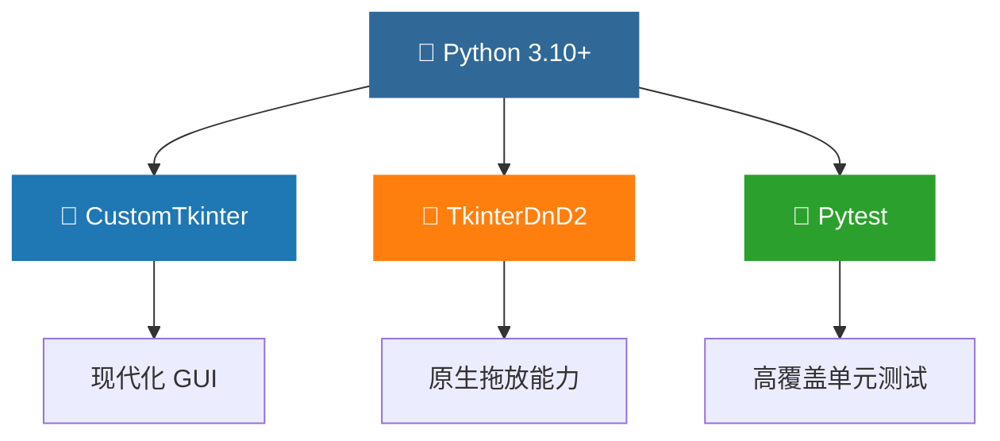
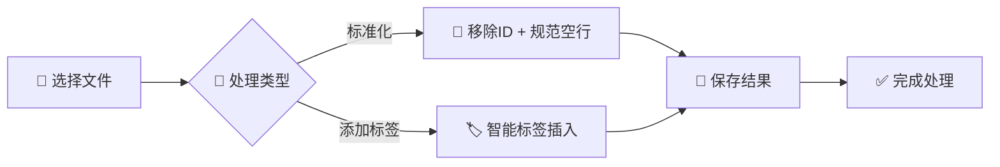
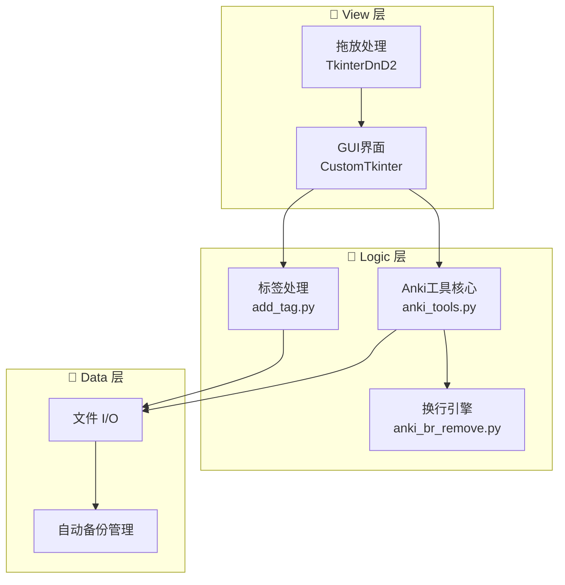

<div align="center">

# 🎴 ANKI TOOL FOR NOTE

```text
    ___               __   _     ______            __ 
   /   |  ____       / /__(_)   /_  __/___  ____  / / 
  / /| | / __ \     / //_/ /     / / / __ \/ __ \/ /  
 / ___ |/ / / /    / ,< / /     / / / /_/ / /_/ / /   
/_/  |_/_/ /_/    /_/|_/_/     /_/  \____/\____/_/    
                                                      
```

[](https://github.com/SaintFore/tool_for_anki)
[](https://www.python.org/)
[](LICENSE)
[](https://github.com/SaintFore/tool_for_anki)

**"A powerful note surgery kit for Anki perfectionists."**
专为 Anki 完美主义者打造的笔记手术刀。

[Quick Start](#-安装方法) • [Features](#-功能特性) • [Architecture](#-项目架构) • [Tech Stack](#-技术栈)

</div>

---

## ✨ 功能特性 (Features)

- 🧹 **移除 Anki ID 标记** - 无情清理笔记中冗余的 `<!--ID: ...-->` 标记，还原纯净文档。
- 📏 **规范化空行** - 智能算法自动调整文档间距，确保在不同设备上格式如一。
- 🏷️ **智能添加标签** - 语义化识别段落边界，自动追加自定义标签，分类管理一气呵成。
- 🖱️ **拖放式交互** - 深度集成 `TkinterDnD2`，告别繁琐的选择路径，拖入即处理。
- ⚡ **批量处理引擎** - 支持并发处理大量 `.md` 文件，效率提升一个量级。
- 💾 **备份保护协议** - 每次写操作前自动触发快照备份，确保数据绝对安全。

## 🔧 技术栈 (Tech Stack)



## 📥 安装方法 (Installation)

### 🎯 极速体验 (Binary)
1. 前往 [Releases](https://github.com/SaintFore/tool_for_anki/releases) 页面。
2. 下载最新的 `Anki笔记处理工具.zip`。
3. 解压并运行 `Anki笔记处理工具.exe`。

### 🔧 源码编译 (Developer)
```bash
git clone https://github.com/SaintFore/tool_for_anki.git
cd tool_for_anki
pip install -r requirements.txt
python main.py
```

## 🚀 快速开始 (Workflow)



## 🏗️ 项目架构 (Architecture)



## 🧪 测试覆盖 (Testing)

```bash
# 运行自动化测试套件
pytest tests/test_anki_tools.py -v
```

## 📄 许可证 (License)

Based on the [MIT License](LICENSE).

---

<div align="center">
Made with 🎴 by <a href="https://github.com/SaintFore">SaintFore</a>
</div>
